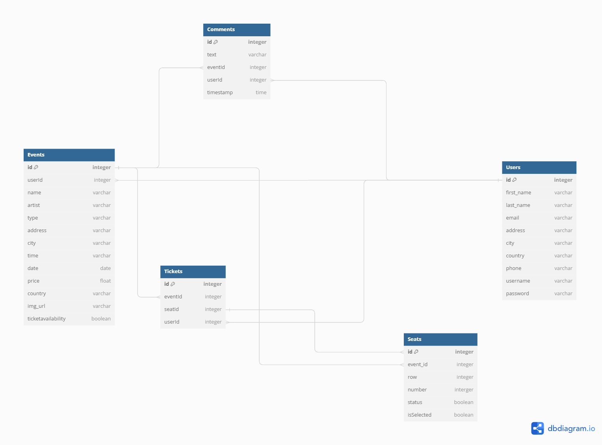

Schema:

##[Render.com]: https://ticket-pass.onrender.com

# User Stories
Stories are defined as bellow:

## User Registration:
1. As a new user, I want to be able to sign up for an account so that I can access the features of the app.
2. As a user, I want to be able to log in to my existing account so that I can manage my events and tickets.

## Event Discovery:
1. As a user, I want to browse through a variety of events categorized by type, location, and date so that I can find events that interest me.
2. As a user, I want to be able to search for specific events by name or keyword so that I can quickly find the ones I'm looking for.

## Ticket Booking:
1. As a user, I want to view event details and ticket availability so that I can decide which events to attend.
2. As a user, I want to be able to select tickets I want and proceed to the booking process.
3. As a user, I want to review the total cost of my tickets before making a payment.

## User Comments:
1. As a user, I want to be able to leave comments and feedback on events I've attended so that I can share my experiences with others.
2. As a user, I want to be able to view comments left by other users on events so that I can get an idea of what to expect.

## Seats
1. As a user, I want to be able to select specific seats for an event so that I can choose my preferred viewing experience.
This involves displaying a seat map and allowing users to select seats based on their preferences
2.As a user, I want to be able to delete a ticket I have purchased

# MVP

## User Registration:
1. Sign up page with fields for username, email, and password.
2. Login page with fields for email and password.
3. Authentication system to create and authenticate user accounts.

## Event Discovery:
1. Homepage displaying a list of events with basic information such as name, date, and location.
2. Users should be able to create a event.
3. Users should be able to update their event(s)
4. Users should be able to delete their events(s).
5. Filters and sorting options to browse events by type, location, and date.(later)
6. Search functionality to find events by name or keyword.(later)

## Ticket Booking:
1. User should be able to purchase a ticket by seleting event and choose seat.
2. Details page that displays information for a ticket held by the current user.
3. User should be able to delete a ticket if the event has not occurred.
4. Checkout process where users can review their selected tickets and the total cost before proceeding to payment.

## User Comments:
1. Comments section on event details page where users can leave comments and feedback.
2. Display of comments left by other users on the event details page.

## Seat: 
1. Display an interactive seat map for each event venue.
2. Allow users to click on available seats on the map to select them.
3. After selecting seats, users should be able to proceed directly to the checkout page, where they can review their selections and see the total cost.
