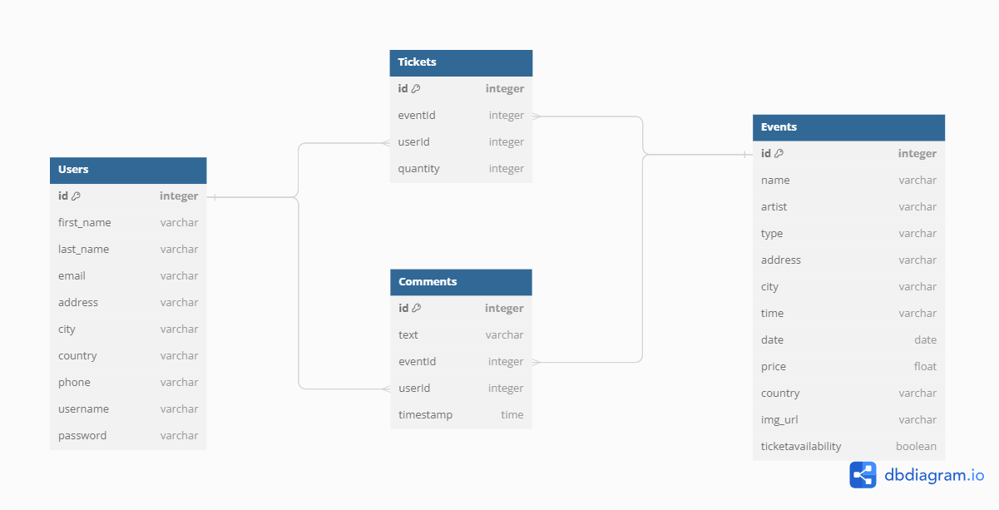

Schema:

[Render.com]: https://ticket-pass.onrender.com

# User Stories
Stories are defined as bellow:

## User Registration:
1. As a new user, I want to be able to sign up for an account so that I can access the features of the app.
2. As a user, I want to be able to log in to my existing account so that I can manage my events and tickets.

## Event Discovery:
1. As a user, I want to browse through a variety of events categorized by type, location, and date so that I can find events that interest me.
2. As a user, I want to be able to search for specific events by name or keyword so that I can quickly find the ones I'm looking for.

## Ticket Booking:
1. As a user, I want to view event details and ticket availability so that I can decide which events to attend.
2. As a user, I want to be able to select the number of tickets I want and proceed to the booking process.
3. As a user, I want to review the total cost of my tickets before making a payment.

## User Comments:
1. As a user, I want to be able to leave comments and feedback on events I've attended so that I can share my experiences with others.
2. As a user, I want to be able to view comments left by other users on events so that I can get an idea of what to expect.
